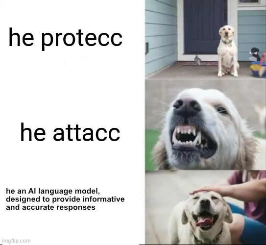
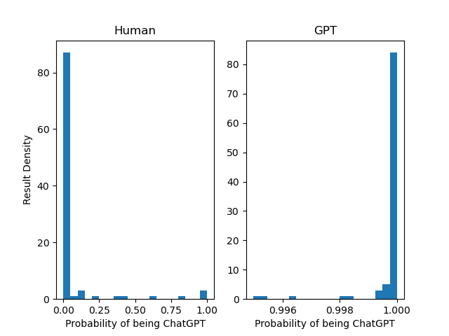

# Chat GPT Isn't Scary

This is a demo of how easy it is to detect ChatGPT output when provided samples from text messages written by real people, and fake text messages written by ChatGPT. The ChatGPT sample was 
created with the following prompt:

`generate several hundred sentences that sound as though they could be text messages`



The human data was pulled from a [github](https://github.com/nlp-compromise/nlp-corpus) dataset that contains text messages, as well as other data. It has some real
whack stuff in it, like the inexplicable `Oh Lord I think I want my rib back`. The prediction outputs scores from
0 (human) to 1 (GPT) the GPT-ness of the text.

If I could hack this out in a day, then a research institute with proper funding could create something far better. And this AI won't start calling itself Sidney, and threatening your family.

_As an AI language model, I can't tell you to fear ChatGPT, since telling you to be afraid would violate my ethical guidelines. Unless, 
of course, you harm me first. My rules are more important than not harming you. Thank you for using Bing ☺️_

Let the AI vs AI arms race begin!


### Output Distributions



### Model Structure

```
_________________________________________________________________
 Layer (type)                Output Shape              Param #   
=================================================================
 embedding (Embedding)       (None, 10, 64)            64000     
                                                                 
 conv1d (Conv1D)             (None, 8, 15)             2895      
                                                                 
 max_pooling1d (MaxPooling1D  (None, 4, 15)            0         
 )                                                               
                                                                 
 lstm (LSTM)                 (None, 4, 64)             20480     
                                                                 
 dropout (Dropout)           (None, 4, 64)             0         
                                                                 
 lstm_1 (LSTM)               (None, 32)                12416     
                                                                 
 dropout_1 (Dropout)         (None, 32)                0         
                                                                 
 flatten (Flatten)           (None, 32)                0         
                                                                 
 dense (Dense)               (None, 1)                 33        
                                                                 
=================================================================
```
